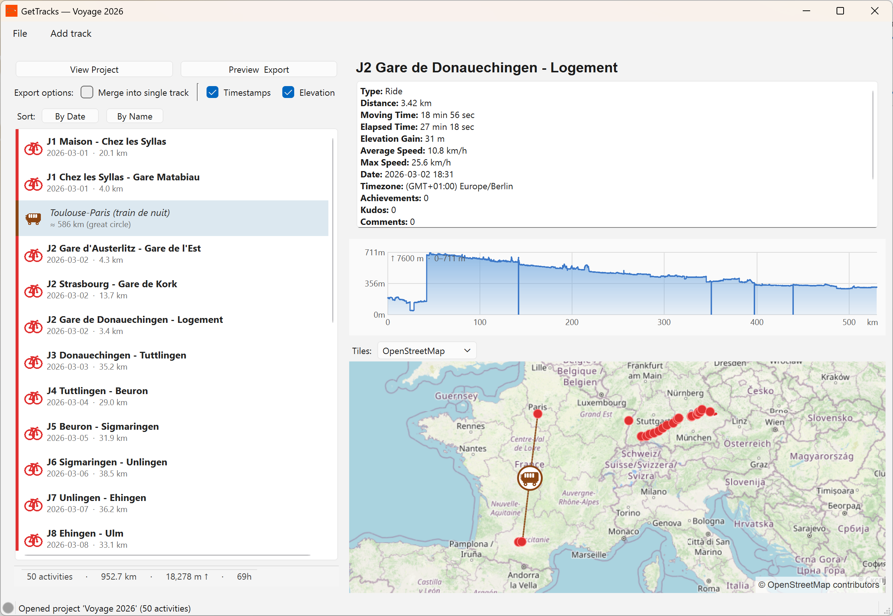
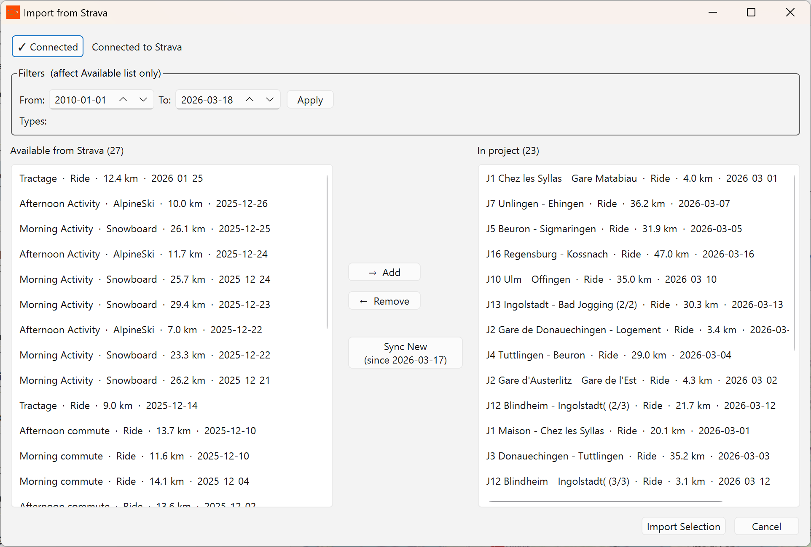
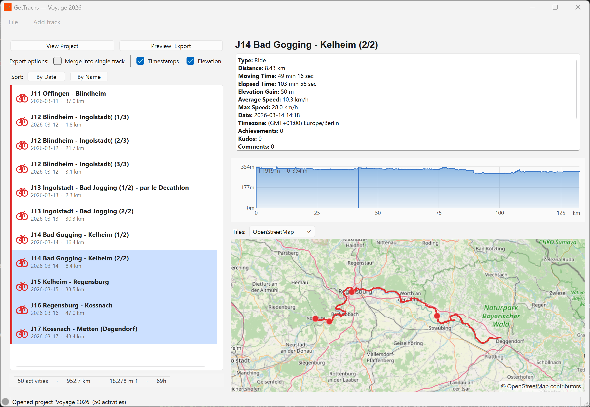
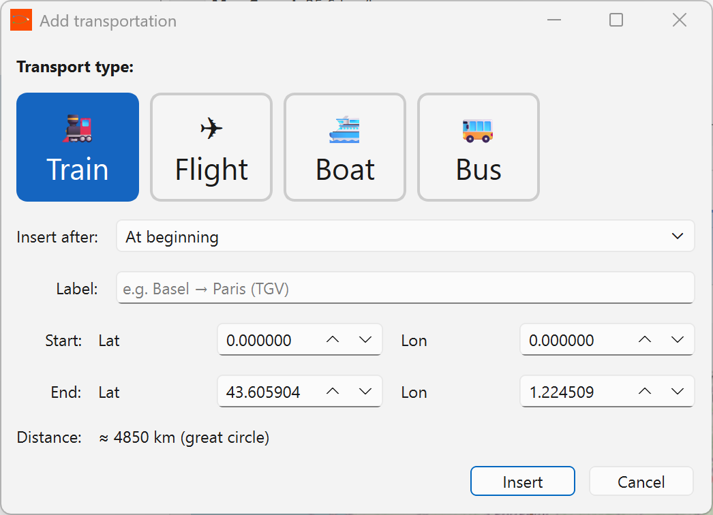

# GetTracks

> Build multi-sport GPS journey files from your Strava activities — with connecting transport segments, elevation profiles, and one-click GPX export.

**Current release: [v1.2.0](https://github.com/rui-nar/GetTracks/releases/latest)**  ·  Windows 64-bit  ·  No installation required

---

## Screenshots

### Main window — project view with elevation chart


### Strava import dialog


### Multi-activity selection with aggregated elevation


### Add Transportation segment dialog


---

## What it does

GetTracks lets you assemble a **project** — an ordered list of Strava activities and connecting transport legs (train, flight, boat, bus) — and export it as a single GPX file ready for a GPS device or mapping site.

Typical workflow:
1. **Add track → From Strava…** — authenticate once, fetch your activities, pick the ones you want
2. **Add track → From GPX file…** — import locally-recorded tracks alongside Strava ones
3. **Add track → Transportation…** — insert a great-circle arc between two activities (e.g. a train between two runs)
4. Drag to reorder items in the project list
5. **View Project** — instant map + elevation overview using cached data, no API call
6. **Preview & Export** — fetch full GPS streams, preview on the map, then save as GPX

---

## Features

### Project system
- Projects saved as `.gettracks` files (JSON) — reopen and continue where you left off
- Ordered list of **activities** (Strava or GPX) and **connecting segments** (transport arcs)
- Drag-and-drop reordering; right-click to insert or remove segments
- Sort by date or name while preserving segment positions

### Map
- Native Qt tile map (OpenStreetMap / Carto) — no browser, no WebView
- Activity tracks rendered with per-sport colour coding
- Connecting segments drawn as dashed great-circle arcs with transport icons
- Multi-activity selection shows a combined map view of all selected tracks

### Elevation chart
- Shown automatically when a project loads — no click required
- Single activity: individual profile
- Multi-select or full project: aggregated profile across all activities in order
- Dynamic X-axis tick marks that adapt to total distance
- Profiles cached on first fetch and persisted in the project file — never re-fetched

### Import
| Source | How |
|---|---|
| Strava | OAuth2, incremental sync (only fetches new activities) |
| GPX file | Per-track import with full elevation data |
| Transportation | Train / Flight / Ship / Bus arc between any two points |

### Export
- GPX with one `<trk>` per project item (activities at full resolution + transport arcs as 50-point great-circle tracks)
- Configurable options (track name, timestamps, …)
- Preview on map before saving

### Authentication
- Strava token stored in `~/.config/GetTracks/tokens.json` — survives restarts
- Auto token refresh; clear + friendly prompt on failure

---

## Quick start (pre-built Windows exe)

1. Download `GetTracks-v1.2.0-windows.zip` from the [latest release](https://github.com/rui-nar/GetTracks/releases/latest)
2. Extract anywhere and open the `GetTracks` folder
3. Copy `config/config.json.example` → `config/config.json` and fill in your Strava API credentials:
   ```json
   {
     "strava": {
       "client_id": "YOUR_CLIENT_ID",
       "client_secret": "YOUR_CLIENT_SECRET",
       "redirect_uri": "http://localhost:8000/callback"
     }
   }
   ```
4. Run `GetTracks.exe`

> **Strava API credentials** — create a free application at [strava.com/settings/api](https://www.strava.com/settings/api). Set the *Authorization Callback Domain* to `localhost`.

---

## Run from source

```bash
git clone https://github.com/rui-nar/GetTracks.git
cd GetTracks

python -m venv .venv
# Windows
.venv\Scripts\activate
# macOS / Linux
source .venv/bin/activate

pip install -r requirements.txt
```

Copy and edit the config:
```bash
cp config/config.json.example config/config.json
# fill in client_id and client_secret
```

Launch:
```bash
python main.py
```

---

## Development

### Requirements
- Python 3.11+
- PyQt6, requests, gpxpy, polyline (see `requirements.txt`)

### Run tests
```bash
pytest
```

### Build Windows exe
```bash
pyinstaller -y --clean GetTracks.spec
# output: dist/GetTracks/
```

### Project structure
```
src/
  api/          Strava API client + rate limiter
  auth/         OAuth2 flow, token storage
  gui/          All PyQt6 windows and widgets
  models/       Activity, Project, ProjectItem dataclasses
  project/      ProjectManager, ProjectIO (save/load .gettracks)
  visualization/ MapWidget, MapCanvas, ElevationChart, transport icons
  gpx/          GPX processor (merge + export)
  filters/      Date / type filter engine
```

---

## Changelog

### v1.2.0
- **View Project** button: instant full-project map + elevation, no API call
- **Multi-activity selection**: combined map and aggregated elevation across selected tracks
- Transport segments shown in Preview & Export map overlay
- Custom silhouette icons for transport types and activity types
- Elevation chart visible on app open (no click required)
- Dynamic elevation chart X-axis tick marks
- Elevation profiles persisted in project file — fetched once, never again
- Strava token stored in `~/.config/GetTracks/tokens.json` (reliable across restarts)
- Fixed OAuth callback on Windows 11 (IPv6/localhost issue)
- Strava 401 auto-refresh with clear + friendly dialog message
- Add Transportation dialog with visual icon picker and auto-fill

### v1.1.0
- Native Qt slippy map (replaces WebView)
- Connecting transport segments with great-circle arc rendering
- Reorderable project list with drag-and-drop
- GPX export with segment tracks

### v1.0.0
- Initial release: Strava import, activity list, basic GPX export
